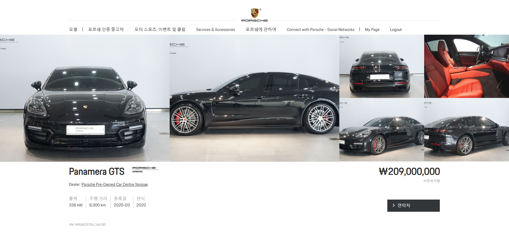
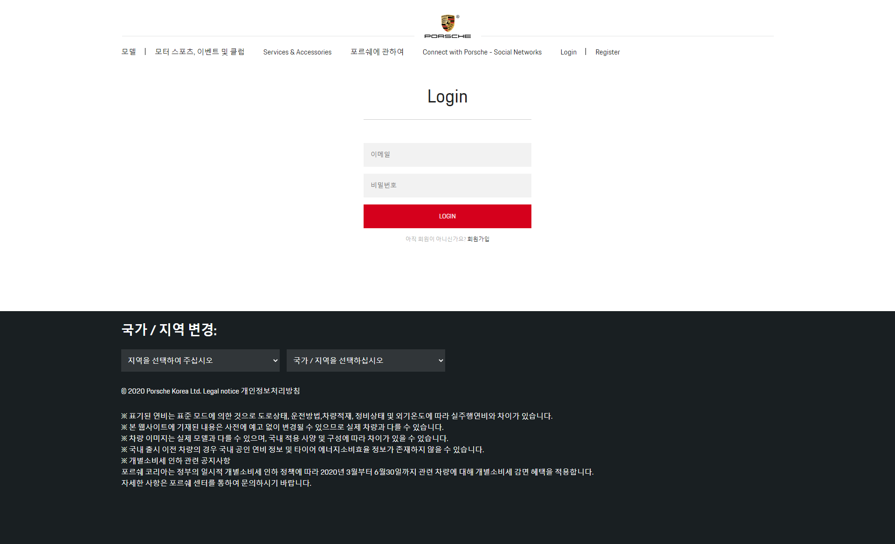
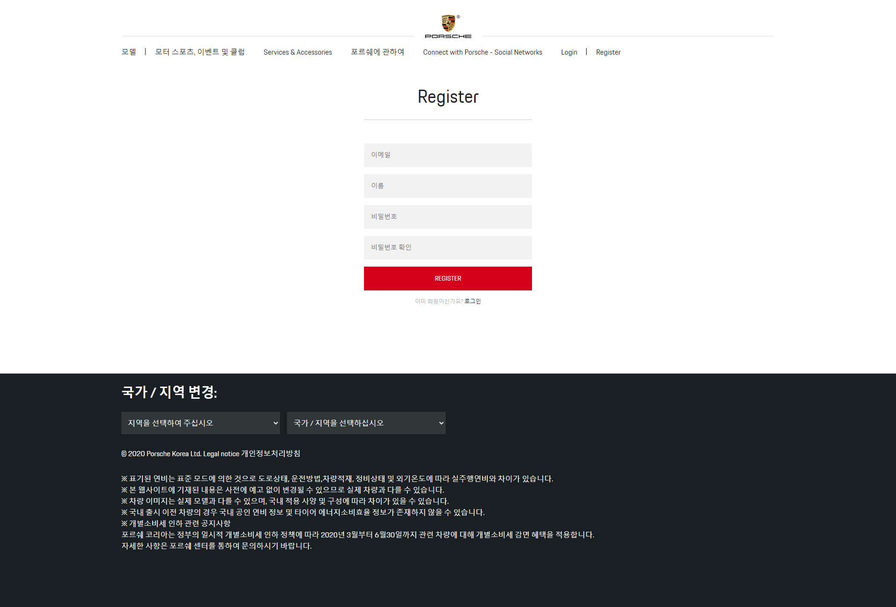
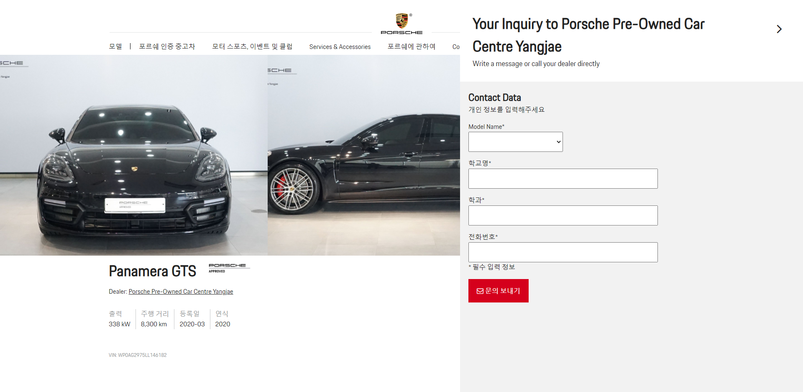
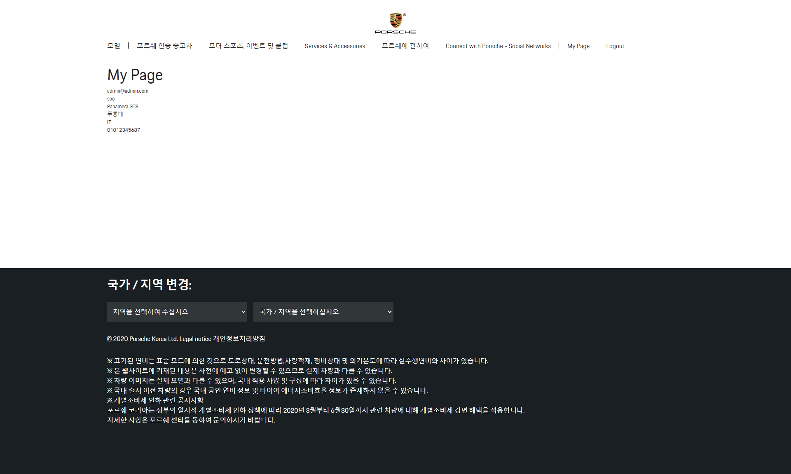

# PORSCHE (website clone coding)

## 사용기술

- React
- SCSS(SASS)

### 동아리원들을 대상으로 한 세미나입니다.

- 포르쉐 웹사이트를 거의 비슷하게 클론코딩 했습니다.
- 사진은 매일 바뀌므로 레이아웃만 보시면 됩니다.

## How to use?

`yarn start`

# 원본

[사이트](https://www.porsche.com/korea/ko/)

1. 메인페이지 원본
   

2. 포르쉐 인증 중고차 원본
   

3. 로그인, 회원가입 페이지는 없습니다.

# 만든 페이지들

1. 메인페이지
   

2. 포르쉐 인증 중고차
   

3. 로그인 페이지
   

4. 회원가입 페이지
   

5. 딜러 예약
   

6. 마이페이지
   

## 주의!

- 눈대중으로 대략 보고 코딩을 했습니다.
- 따라서 몇픽셀은 안맞을수 있습니다.

## Coming Soon...

- [Lamborghini](https://www.lamborghini.com/en-en)
- 여유가 되면 해보도록 하겠습니다.
- 근데 여유가 안될것같아요 ㅎㅎ;
